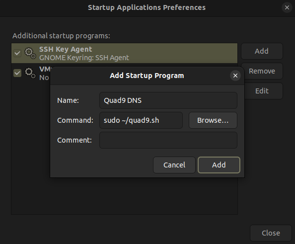

# Setting Quad9 as Your Default DNS Resolver
Quad9 is a non-profit DNS resolver. If you want to set Quad9 as your default DNS resolver, you can do so by running the `quad9.sh` bash script in this repository. Just follow the steps below:

1. **Navigate to the directory** where you want to save the `quad9.sh` file and clone this repository or download the `quad9.sh` file and move it to the desired location . If you cannot clone this git repository or download the file, then type `sudo nano quad9.sh`. Copy the bash script (code) from the `quad9.sh` file in the repository and paste it into the nano editor. You can do this by pressing `Ctrl+Shift+C`. Type `Ctrl+O` to save it, then `Ctrl+X` to exit.

2. **Change the file permissions** to make the script executable by running the following command:

    ```bash
    user@linux:~$ sudo chmod 777 quad9.sh
    ```

3. **Add the script to startup applications** go to Startup Applications or equivalent from the Linux GUI search bar and select the ‘+’ sign or ‘add’ option to add a new startup command. Use `sudo` for escalated privilege and write the command like the image below. (Don’t forget to add the location of the quad9.sh file which could be like /etc/quad9.sh)![Alt text]

4. Restart your system and check if Quad9 is set as your nameserver by running `cat /etc/resolv.conf` in the terminal. You should see something like this:

    ```text
    #     DO NOT EDIT THIS FILE BY HAND -- YOUR CHANGES WILL BE OVERWRITTEN
    # 127.0.0.53 is the systemd-resolved stub resolver.
    # run "systemd-resolve --status" to see details about the actual nameservers.

    nameserver 9.9.9.9
    ```

    Or, use this command 
    ```bash
    user@linux:~$ nslookup www.google.com
    ```
    the output will be something like this 
    ```text
    Server:		9.9.9.9
    Address:	9.9.9.9#53
    ```
    That's it. Now Quad9 is your default dns resolver. If you want to stop it just delete the startup command 